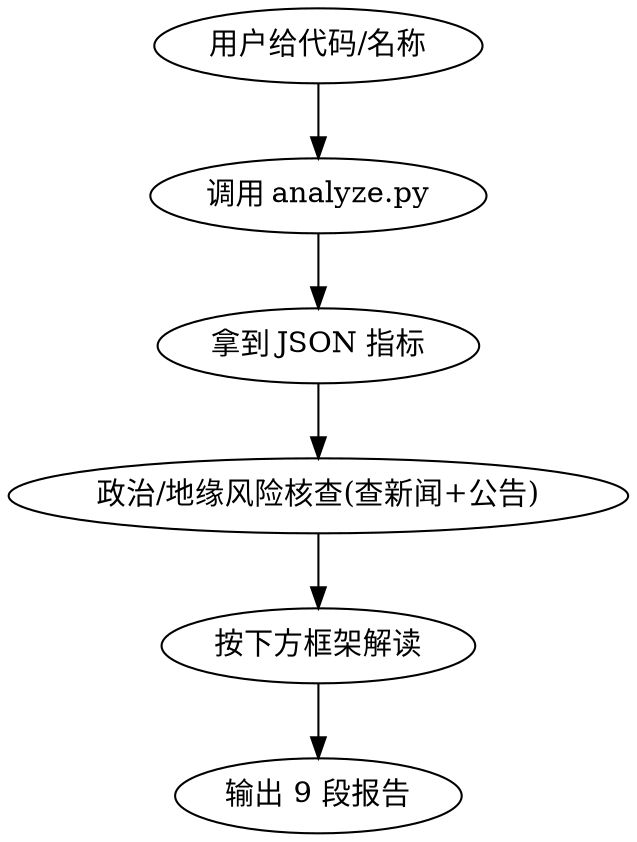

# A股量价 + 筹码 + 公司质地分析

## 核心原则

**量在价先** - 成交量是唯一不滞后的真指标,主动资金(市价单)推动价格(蒸汽推动火车)。

**筹码换手** - 交易即换手,各价位持仓占比形成筹码峰。峰越高 = 该价位持仓越多;下方筹码 = 支撑,上方筹码 = 压力;越集中 = 市场分歧越小 = 波动合力越强。

**成长 vs 周期** - 成长股靠需求扩张 + 护城河,利润复利增长,适合长期持有;周期股利润由供给松紧决定,重资产扩产滞后易过剩暴跌,只能波段操作。把周期股当成长股死扛是常见陷阱。

三条主线:量价(当下) + 筹码(历史) + 公司质地(类型)。

## 触发条件

- 用户对 A 股股票 asking 买卖建议、走势诊断、量价分析、公司质地判断
- 用户说"分析 000001 / 看看平安银行 / XXX 怎么样"
- 用户贴 A 股行情问后续操作

**不触发:** 港股/美股、纯消息面分析。

## 执行流程



### 第 1 步:取数 + 算指标

```bash
cd ~/.claude/skills/stock-analysis/scripts
python3 analyze.py <代码或名称> [--days 120]
python3 analyze.py 000001 --no-fundamental  # 跳过基本面(网络差时)
```

脚本输出 JSON,包含:basic、indicators(position / volume / quadrant / trend_5d / divergence / traps / breakout / five_step / chip)、fundamental(classification / pe_trap / investment_approach / geopolitical_risk)。

**脚本失败处理:**
- 网络错误(akshare 连不上 eastmoney)-> 告诉用户"数据源连不上,请检查网络/VPN",可用 `--no-fundamental` 跳过基本面只做量价分析
- 股票未找到 -> 让用户确认代码或名称
- 数据不足 120 天 -> 脚本自动降级,报告里标注

### 第 2 步:政治/地缘风险核查(手动)

脚本会自动识别公司是否暴露在政治/地缘/政策风险下(见矩阵 6),但**风险是否兑现需 Claude 结合最新新闻和企业公告判断**:

- 命中 `overseas_resource`:查资源国政局新闻 + 公司海外资产减值公告
- 命中 `sanction`:查 BIS 实体清单 + 出口管制新规 + 公司供应链影响公告(同时判断是受损方还是国产替代受益方)
- 命中 `policy_dependency`:查最新政策文件 + 集采中标价 + 补贴退坡公告
- 命中 `strategic_resource`:查出口管制清单 + 公司出口业务占比(通常反向受益)
- 命中 `consumer_policy`:查消费税政策 + 医美监管文件 + 高端消费批价变化

无法核实或信息不足时,在报告中明确标注"待核查",不要臆断。

### 第 3 步:按框架解读 JSON

用下方的矩阵和清单,把 JSON 里的指标翻译成诊断结论。每一段都要引用 JSON 里的具体数值。

## 矩阵 1:5 日量价趋势 × 位置语境

**主信号:`indicators.trend_5d`**(近 5 日线性回归斜率,归一化为日均变化率%)。单日信号噪音大,5 日趋势反映真实主力意图。

从 `indicators.trend_5d.quadrant` 取 5 日趋势象限(量增/缩/平 × 价涨/跌/平),从 `indicators.position.label` 取位置,查表:

|              | 低位          | 高位          |
|--------------|---------------|---------------|
| 量增价涨     | 黄金信号(主力扫货) | 诱多陷阱(对倒出货) |
| 量增价跌     | 见底信号(接恐慌盘) | 逃顶信号(主力出逃) |
| 量缩价涨     | 筹码锁定(主升浪拿稳) | 买盘枯竭(危险) |
| 量缩价跌     | 洗盘低吸(回调缩量) | 阴跌别碰(无承接) |
| 量平/价平    | 信号弱,等方向选择 | 信号弱,等方向选择 |

中位(20-80%)的信号弱,需结合其他证据。

**辅助:`indicators.quadrant.quadrant`**(今日 vs 昨日单日象限)用于拐点验证:
- 单日与 5 日趋势一致 → 趋势确认
- 单日与 5 日趋势不一致 → 可能拐点(5 日上涨但今日量缩价跌 = 见顶征兆;5 日下跌但今日放量价涨 = 见底征兆)

**5 日趋势强度:** `trend_5d.strength`(弱/中/强),基于斜率归一化比值。"强"意味着趋势已充分发酵,追入风险高;"弱"可能是早期信号。

**一致性:** `trend_5d.consistency`(如 4/4),近 4 日单日象限与 5 日趋势象限一致的天数。一致性 ≥ 3/4 趋势可靠;< 2/4 可能是震荡而非趋势。

### 1.1 量价组合细化(补充组合)

从 `indicators.volume_price_detail.signals` 读取,矩阵1的4大组合之外补充:

| 组合 | 位置 | 细分 | 含义 |
|------|------|------|------|
| 量增价平 | 低位 | 吸筹 | 主力吸筹,等放量启动 |
| 量增价平 | 高位 | 出货 | 主力派发,警惕 |
| 量缩价涨 | 均线陡峭 | 高控盘 | 主升浪,易连板,拿稳 |
| 量缩价涨 | 均线疲软 | 资金枯竭 | 买盘枯竭,危险 |
| 极致地量 | 低位 | 换手<1%+量缩 | 见底信号 |
| 历史天量 | 高位 | 换手接近120日天量 | 派发信号 |

**均线陡峭度判断:** `volume_price_detail.ma5_slope` > 0.02(日均 2%)= 陡峭(高控盘);< 0.02 = 疲软(资金枯竭)。

## 矩阵 1.5:换手率分级标尺

从 `indicators.turnover` 读取。换手率是标准化的量能标尺(成交量绝对值受流通盘大小影响,换手率跨股票可比)。

| 换手率 | 分级 | 含义 | 操作提示 |
|--------|------|------|----------|
| <1% | 冷门 | 极致地量 | 低位=见底信号;高位=无人接盘 |
| 1%-3% | 常态 | 正常波动 | 观望 |
| 3%-5% | 偏活跃 | 关注 | 留意 |
| 5%-10% | 活跃 | 主力参与 | 跟踪方向 |
| 10%-15% | 高度活跃 | 警惕 | 高位=派发信号 |
| >15% | 套现警戒 | 高位股大概率主力套现 | 高位减仓 |

**历史天量信号:** `turnover.is_top_signal`(120日内出现 ≥2 次天量,天量 = 换手率 ≥ 10%)= **阶段顶部信号**。A股两次历史天量常对应阶段顶部。

**核心原则:** 成交量不可造假,K线等指标可造假。换手率是判断筹码转移方向的标准化标尺。

## 矩阵 2:筹码峰形态(换手率衰减 + 底仓追踪)

### 2.1 物理基础:筹码守恒

从 `indicators.chip.decay_meta` 读取衰减模式:
- **turnover 模式**(有流通股本):每日筹码保留率 = (1 - turnover_t),turnover_t = vol_t / 流通股本。**真实换手数据藏不住主力操作**。
- **fixed 模式**(无流通股本兜底):固定 decay=0.05(半衰期 ~13 天)。

主力再怎么对倒、藏仓,真实换手率会暴露筹码转移。底仓追踪就是基于此:

### 2.2 三大形态 + 升级信号

从 `indicators.chip.pattern` 读取,三种典型形态 + `enhanced_signal` 升级标记:

| 形态 | 位置语境 | 含义 | 升级信号 | 操作 |
|------|----------|------|----------|------|
| 低位单峰 | 主峰在区间下沿,贴近当前价 | 主力吸筹 | **主升浪信号**:今日换手 <1.5%(无量突破) | 关注放量,准备低吸 |
| 高位单峰 | 主峰在区间上沿,贴近当前价 | 出货风险 | **见顶信号**:底仓消失(保留率 <20%) | 立即减仓 |
| 双峰 | 两个显著峰,当前价在两峰之间 | 区间震荡 | **洗盘信号**:底仓保留率 ≥50%(不萎缩) | 区间内高抛低吸 |

### 2.3 底仓追踪(反人性信号)

从 `indicators.chip.bottom_retention` 读取:
- **底仓不动**(价格涨 ≥30% + 底仓保留率 ≥50%):散户早止盈了,底仓不动说明主力还在 - **主升浪续涨信号**,不是出货!
- **底仓消失**(保留率 <20%):主力出货完成 - 见顶信号
- **底仓部分转移**(20-50%):信号不明确,结合其他证据

反人性洞察:涨 30-50% 底部筹码不动 = 要翻倍的信号,不是出货。

### 2.4 ASR / CYQK 辅助指标

从 `indicators.chip.asr` / `indicators.chip.cyqk` 读取:

| 指标 | 含义 | 关键判断 |
|------|------|----------|
| ASR | ±10% 带内筹码占比(活动筹码) | 下跌中 ASR 高(≥50%) = 筹码锁死,主力控盘 |
| CYQK_WIN | 当前价下方筹码占比(获利比例) | <40% 套牢多反弹抛压小;>80% 获利多抛压渐增 |

辅助:`chip.support_resistance.support/resistance`(支撑/压力位)、`chip.concentration_5pct`(≥40% 高度集中)。

## 矩阵 3:成长 vs 周期 公司质地(财务 + 行业叙事)

从 `fundamental.classification` 读取,核心是先判断类型再解读 PE。

### 3.1 类型判定逻辑

| 类型 | 财务特征 | 典型行业 |
|------|----------|----------|
| 成长 | ROIC 高且稳定(cv<0.3)+ 利润持续正增长 + FCF 匹配利润(比率≥0.5) | 医药、消费电子、半导体、软件 |
| 成长(叙事强化) | 财务成长 + 行业有 AI/国产替代等叙事 | AI 算力、国产替代、创新药 |
| 周期 | 利润大幅波动(某年跌幅>30%)或 ROIC 不稳定(cv>0.4) | 钢铁、有色、煤炭、化工、航运、房地产 |
| **周期(有成长潜力)** | 财务周期 + 行业有成长叙事(AI/国产替代/机器人等) | 存储芯片、半导体设备、减速器、MCU |
| 伪成长 | 表面利润增长但 ROIC 下滑或 FCF 长期为负 | 扩产过度的"成长赛道" |
| 待定 | 数据不足 | - |

**财务指标优先于行业归类。** 即使行业是"成长",若财务呈现周期特征,按周期股处理。
**但有成长叙事时**需额外标记"周期(有成长潜力)",不能纯按周期波段操作。

### 3.2 PE 陷阱(关键!)

| 类型 | PE 表现 | 含义 |
|------|---------|------|
| 周期 | PE 极低(<10)+ 利润近期暴增 | ⚠️ **见顶信号**(供给即将过剩) |
| 周期 | PE 极高或为负(行业亏损) | ✅ **潜在买点**(低谷布局) |
| 周期(有成长潜力) | PE 高(>60) | ⚠️ 叙事溢价,**需 Q2/Q3 业绩验证转成长逻辑**,否则估值杀 |
| 周期(有成长潜力) | PE 中性(15-60) | 等业绩验证,观望或轻仓 |
| 成长 | 高 PE + ROIC 稳定增长 | 可接受(业绩消化估值) |
| 成长 | 高 PE + ROIC 下滑 | ⚠️ 估值杀风险 |
| 伪成长 | 任何 PE | ⚠️ 不可靠,表面成长实为价值毁灭 |

**经典案例:** 碳酸锂 2022 年 PE 个位数(见顶)、海运 2020 年行业亏损(买点)。把周期股低 PE 当成长股买 = 顶部接盘。
**叙事案例:** 兆易创新 2026 PE 140x + 财务周期 + AI 算力叙事 = "周期(有成长潜力)",PE 高可接受但需 Q2 业绩验证,否则估值杀。

### 3.3 行业叙事维度(识别周期转成长潜力)

从 `fundamental.classification.narrative` 读取。财务指标是滞后的,只看历史财务会把"周期转成长中"的公司错判为纯周期。

| 叙事 ID | 关键词 | 成长潜力说明 |
|---------|--------|--------------|
| `ai_compute` | 存储芯片/DRAM/NAND/HBM/DDR5/光模块/AI算力/PCB | AI 需求拉动高端存储/光模块涨价周期,周期转成长潜力 |
| `domestic_substitution` | 半导体设备/材料/EDA/MCU/国产替代/光刻 | 国产化率低,提升空间大,政策驱动 |
| `robotics` | 减速器/伺服/谐波/机器人/RV减速器/丝杠 | 人形机器人量产预期,题材估值溢价高 |
| `innovative_drug` | ADC/GLP-1/创新药/CXO/生物医药 | 创新药出海 + 大单品 |
| `high_end_manufacturing` | 数控机床/工业软件/高端装备/航空航天/电力设备/输配电/电网/特高压/智能电网/工程机械/叉车 | 进口替代 + 出海 + 电网投资 |

**应用规则:**
- 财务周期 + 有叙事 -> "周期(有成长潜力)",波段为主 + 跟踪业绩验证
- 财务成长 + 有叙事 -> "成长(叙事强化)",长期持有 + 关注叙事兑现进度
- 财务周期 + 无叙事 -> 纯周期,波段操作
- 财务成长 + 无叙事 -> 纯成长,长期持有

### 3.4 行业风险:成长赛道转周期

`fundamental.classification.evidence` 中若标 `growth_to_cyclical_risk: true`,表示该行业存在"渗透率触顶 + 前期扩产集中释放"风险,成长逻辑可能转周期。典型:光伏、新能源汽车、风电、消费电子、半导体、显示器件。

龙头大额减值是转周期的标志信号。

### 3.5 鉴别指标(从 `fundamental.classification` 读取)

| 指标 | 真成长 | 伪成长 / 周期 |
|------|--------|---------------|
| ROIC 趋势 | 长期高且稳定,可再投 | 下滑(扩产消耗价值) |
| FCF / 净利润 | ≥0.5,现金流匹配利润 | <0.3,盈利但现金流差 |
| 利润增长 | 持续为正 | 大起大落 |
| **毛利率趋势** | 上升或平稳(定价权强) | 下降(竞争加剧/成本上行) |
| **营收增长** | 持续正增长(支撑利润) | 波动或下降(利润增长不可持续) |
| **扣非/净利润** | ≥0.9(主业贡献) | <0.7(一次性损益多,盈利质量差) |

**关键警示:** 营收不增但利润增 = 利润操纵嫌疑(降成本/一次性损益),在 evidence 中标记 ⚠️。

**季节性调整:** `fundamental.classification.roic.seasonal_adjusted = true` 时,ROIC cv 用年度数据(period 末尾 1231)计算,避免季度季节性失真。电力设备、电网、工程机械等 Q4 集中回款行业,季度 ROIC 波动天然大,用季度数据算 cv 会高估不稳定性误判为周期股。若 `seasonal_adjusted = false`,需警惕 cv 可能受季节性影响。

### 3.6 ROE 深度分析(巴菲特 + 杜邦 + 假高 ROE 识别)

从 `fundamental.roe_quality` 读取。ROE 是巴菲特选股核心指标(净利润÷净资产),单纯看净利润增速容易踩坑 - 千万本金大厂 ROE 可能才 6%,十万本金小店却能到 30%,资本效率差远了。

**杜邦分析三模式**(`roe_quality.dupont`):

| 模式 | 三因素特征 | 案例 | 风险 |
|------|-----------|------|------|
| 高净利率驱动 | 净利率 >15% | 茅台/爱马仕 | ✅ 安全,定价权强 |
| 高周转驱动 | 周转率 >1.0 | Costco/沃尔玛 | ✅ 稳健,运营效率 |
| 高杠杆驱动 | 权益乘数 >5 | 房企/银行 | ⚠️ 风险大,杠杆依赖 |

**巴菲特三步筛选**(`roe_quality.buffett_filter`):
1. 5-10 年均 ROE >15% + 单年 ≥12%(`step1_roe`)
2. 资产负债率 <50%(`step2_debt`)
3. 经营现金流 ≥ 净利润(`step3_cashflow`)

三步全过 = 长期稳、低负债、现金流匹配的优质标的。

**假高 ROE 识别**(`roe_quality.fake_roe.warnings`):
- `high_leverage`:权益乘数 >5 + 净利率 <10% - ROE 由杠杆驱动非经营效率(房企/银行式,波音举债回购案例)
- `one_shot_gain`:扣非/NI <0.7 - ROE 靠卖资产/政府补贴/投资收益一次性撑高
- `buyback_shrink`:净资产同比下降但净利润未下降 - 疑似回购缩分母推高 ROE(波音案例)

**ROE 稳定性**(`roe_quality.roe_stability`):均值/min/max/cv/趋势 + `buffett_filter`(均>15% + 单年≥12%)。带季节性调整(优先用年报数据)。

### 3.7 机构研报评估(市场观点 + 外资分歧)

从 `fundamental.research_report` 读取。数据来自东方财富研报中心(reportapi.eastmoney.com),聚合 A 股研报评级/目标价/盈利预测,并识别外资/港资/台资合资券商观点。

**评级共识**(`research_report.rating_consensus`):

| 共识强度 | 主导评级占比 | 含义 |
|---------|-------------|------|
| 共识强 | ≥60% | 主导评级可信,作为参考 |
| 共识中 | 40-60% | 分歧存在,谨慎参考 |
| 分歧大 | <40% | 机构观点分裂,警惕 |

主导评级 (`dominant_label`):买入 / 增持 / 中性 / 减持 / 卖出。`score_mean` = 评级分数均值(buy=2, overweight=1, neutral=0, reduce=-1, sell=-2)。

**目标价空间**(`research_report.target_price`):

| 标签 | 上涨空间 | 含义 |
|------|---------|------|
| 空间大 | ≥20% | 机构看多,但需防一致预期陷阱 |
| 空间中 | 5-20% | 中性偏多 |
| 空间小 | -5% ~ 5% | 已接近目标价 |
| 已超目标 | ≤-5% | 已透支机构预期,警惕 |

`spread_pct` = (max-min)/mean,反映机构对目标价的分歧度。

**外资观点**(`research_report.foreign_summary`):识别外资/港资/台资合资券商研报,聚合外资评级共识 + 最近一条外资研报。

外资券商识别(关键词匹配 `orgSName`):
- 国际投行在华合资:高盛高华、瑞银证券、摩根士丹利华鑫、瑞信方正、野村东方国际
- 中资国际子公司:中银国际、招银国际、建银国际、交银国际、海通国际、华泰国际
- 港台资:群益、元大、凯基、第一上海、汇丰前海

**内外资分歧**(`research_report.divergence`):

| 标签 | 评分差 | 含义 |
|------|-------|------|
| 外资明显更乐观 | diff ≥ 1.0 | 外资比内资更看多 |
| 外资略乐观 | 0.5 ≤ diff < 1.0 | 外资略偏多 |
| 内外资一致 | |diff| < 0.5 | 观点一致 |
| 外资略悲观 | -1.0 < diff ≤ -0.5 | 外资略偏空 |
| 外资明显更悲观 | diff ≤ -1.0 | 外资比内资更看空 |

`diff = foreign_score - domestic_score`。`target_price_divergence_pct` = 外资目标价均值相对内资目标价均值的偏离百分比。

**机构认可度信号**(`research_report.quality_signal`):
- `强`:≥10 篇研报 + 共识强(主导评级 ≥60%)
- `中`:≥5 篇 + 共识强度 ≥50%
- `弱`:<5 篇
- `无覆盖`:0 篇

**盈利预测**(`research_report.eps_forecast`):取最近有预测的研报,输出今年/明年/后年 EPS/PE。

**证据已写入 `classification.evidence`**(评级共识 / 目标价 / 外资观点 / 分歧 / 盈利预测 各一条)。

**局限**:免费接口只能拿到东财研报中心数据(合资券商中文研报)。真正的高盛/摩根/瑞银/野村英文原版研报需付费终端(Wind/Choice/Bloomberg/Refinitiv)。

### 3.8 投资思路(从 `fundamental.investment_approach` 读取)

| 类型 | 思路 | 操作 |
|------|------|------|
| 成长 | 长期持有,时间是优势 | 逢低加仓,不轻易波段 |
| 成长(叙事强化) | 长期持有(叙事强化) | 逢低加仓,关注叙事兑现进度 |
| 周期 | 波段操作 | 低谷布局(PE 极高/亏损时),高峰离场(PE 极低/利润暴增时) |
| **周期(有成长潜力)** | **波段为主 + 跟踪业绩验证** | **波段操作为主,关注 Q2/Q3 业绩:若营收+扣非持续增长,逐步转为长期持有;若业绩未兑现,按周期股波段** |
| 伪成长 | 回避 | 不参与 |
| 待定 | 观望 | 补充数据 |

**铁律:** 别把周期股当成长股死扛。但"周期(有成长潜力)"若业绩持续验证,可逐步转为长期持有。

## 矩阵 4:量价背离判拐点

- **顶背离**(`indicators.divergence.top.detected`):价新高 + 量未新高 -> 逃顶
- **底背离**(`indicators.divergence.bottom.detected`):价新低 + 无量 / 放量滞跌 -> 抄底
- **过滤:** 用 `indicators.volume.ma_cross`(5/20日均量线金叉/死叉)确认

## 矩阵 5:主力骗局识别

从 `indicators.traps` 读取:

| 标记 | 含义 | 应对 |
|------|------|------|
| `false_breakout` | 假突破:曾冲阻力位又跌回 | 不追,等站稳 |
| `wash_trade` | 对倒造量:量比>2.5 但涨幅<1% | 警惕主力出货 |
| `algo_no_vol_rise` | 算法无量空涨:量比<0.7 但涨幅>2% | 警惕诱多 |

## 矩阵 6:政治/地缘/政策风险评估

从 `fundamental.geopolitical_risk` 读取。**脚本只做"风险敞口识别"**(判断公司业务是否暴露在某类外部风险下),**风险是否兑现需结合最新新闻和企业公告动态评估**。

### 6.1 风险类型表

| 风险 ID | 命中行业 | 风险描述 | 典型案例 | 核查方向 |
|---------|----------|----------|----------|----------|
| `overseas_resource` | 矿业/油气/钾肥/有色金属 | 海外资产地缘风险:政局动荡、国有化、税收变化、内战 | 紫金矿业(塞尔维亚/刚果金)、赣锋锂业(墨西哥/阿根廷)、中海油(海外油气) | 资源国政局新闻、海外资产减值公告 |
| `overseas_business` | 电力设备/电网/工程机械/家电/客车/海外工程 | 海外业务地缘/汇率风险:贸易摩擦、汇率波动、海外项目政治风险 | 思源电气(欧洲电网改造)、三一重工(海外工程机械)、海尔智家(全球白电)、宇通客车(海外客车) | 汇率波动/贸易摩擦/海外业务占比/海外子公司 |
| `sanction` | 半导体/AI 芯片/军工/EDA | 美国制裁/实体清单:出口管制、技术封锁 | 中芯国际(设备受限)、寒武纪(实体清单)、北方华创(国产替代反向受益) | BIS 实体清单更新、出口管制新规、供应链影响公告 |
| `policy_dependency` | 光伏/新能源车/CXO/教育/游戏 | 政策依赖:补贴退坡、集采降价、监管变化 | 光伏(补贴退坡)、创新药(集采)、CXO(美国生物安全法案+国内集采)、教育(双减) | 政策文件、集采中标价、补贴占比 |
| `strategic_resource` | 稀土/钨/锑/锗/镓 | 出口管制(反向受益):限制海外收入但提升国内定价权 | 北方稀土、厦门钨业 | 出口管制清单、出口业务占比 |
| `consumer_policy` | 白酒/医美/高端消费 | 消费政策/反腐:消费税改革、医美监管、反腐影响高端消费 | 茅台(消费税预期)、爱美客(医美监管) | 消费税政策、医美监管文件、批价变化 |

### 6.2 风险评估流程

1. **脚本识别**(自动):基于行业 + 名称关键词,标记风险敞口类型
2. **Claude 核查**(手动):对每个命中的风险类型,查最新新闻和企业公告:
   - 风险是否已兑现?(如已发生减值、制裁、集采降价)
   - 兑现程度?(部分影响/全面影响)
   - 是否有反向催化剂?(如国产替代叙事同时是制裁风险的反向受益)
3. **综合评级**:对每个风险打 高/中/低 三档
   - 高:已兑现且持续影响业绩(如海外资产已减值、已被列入实体清单)
   - 中:风险存在但未完全兑现(如政策预期、行业整体风险)
   - 低:风险敞口小或已有对冲(如海外业务占比低、已布局国产替代)

### 6.3 风险与叙事的反向关系

部分风险与成长叙事互为反向:
- `sanction` 风险 ⇄ `domestic_substitution` 叙事:美国制裁加速国产替代,被制裁公司受损但国产替代公司受益
- `policy_dependency`(光伏)⇄ `growth_to_cyclical_risk`:补贴退坡 + 产能过剩 = 成长转周期
- `strategic_resource` 风险 = 反向受益:出口管制提升国内定价权

**分析时必须明确:公司是被制裁方还是受益方?** 同一行业不同公司角色可能相反。

## 矩阵 7:半导体行业特殊处理(短期信号优先)

**触发条件**:`fundamental.semiconductor_handling.is_semiconductor = True`

### 7.1 为什么半导体需要特殊处理

半导体行业受**周期 + 技术迭代 + 制裁/国产替代叙事**三重影响,与其他行业判断方式不同:

| 维度 | 普通行业 | 半导体行业 |
|------|---------|-----------|
| 财务数据 | 滞后但可信 | 严重滞后,利润波动大(高研发投入期 + 周期低谷) |
| ROE | 长期均值有参考价值 | 低 ROE 不代表差(高研发期常态) |
| PE 陷阱 | 周期低 PE 见顶/高 PE 买点 | 高 PE/亏损 = 成长期常态,PE 陷阱不适用 |
| 巴菲特三步 | 长期稳 + 低负债 + 现金流匹配 | 对半导体过严,会误判所有半导体为"回避" |
| 估值驱动 | 财务 + 行业 + 叙事 | **短期量价 + 主题叙事 + 制裁政策** |

**铁律:把半导体当普通行业用 ROE/PE 陷阱/巴菲特标准判断 = 系统性误判。**

### 7.2 决策优先级(从高到低)

```
1. 5/10/20 日筹码对比(集中度变化 + 主峰迁移 + CYQK 趋势)
2. 5/10/20 日量价趋势(加速度 + 象限一致性 + 强度)
3. 五步核对(位置/地量/ROVL/金叉/站稳)
4. 量价背离 + 主力骗局(假突破/对倒/无量空涨)
5. 政治风险兑现程度(制裁/EDA 出口管制/实体清单,需查最新新闻)
6. 基本面(ROE/PE/杜邦/巴菲特,仅作参考,不作决策依据)
```

### 7.3 短期筹码对比(从 `indicators.short_term_chip` 读取)

| 字段 | 含义 | 信号 |
|------|------|------|
| `windows[5/10/20].dominant_peak` | 各窗口主峰位置 | 短窗口主峰上移 = 高位承接;下移 = 低位吸筹 |
| `windows[5/10/20].concentration_5pct` | 各窗口集中度 | 短窗口 > 长窗口 = 主力吸筹/锁定 |
| `windows[5/10/20].cyqk_win_ratio` | 各窗口获利比例 | 短窗口 > 长窗口 = 短期获利盘增加,抛压渐增 |
| `windows[5/10/20].asr_value` | 各窗口活动筹码 | 短窗口 > 长窗口 = 筹码向当前价集中 |
| `trend.peak_migration` | 主峰迁移 | 向上/向下/稳定 |
| `trend.concentration_trend` | 集中度趋势 | 上升(吸筹)/下降(派发)/稳定 |
| `trend.cyqk_trend` | 获利盘趋势 | 上升(抛压增)/下降(抛压减)/稳定 |

**关键组合信号**:
- 短期集中度上升 + CYQK 下降 + 主峰稳定 = **主力吸筹**(看多)
- 短期集中度上升 + CYQK 上升 + 主峰上移 = **高位派发**(警惕)
- 短期集中度下降 + CYQK 上升 = **筹码松动 + 获利盘兑现**(看空)

### 7.4 短期量价趋势(从 `indicators.short_term_trend` 读取)

| 字段 | 含义 | 信号 |
|------|------|------|
| `windows[5/10/20].quadrant` | 各窗口象限 | 三窗口一致 = 趋势稳;分歧 = 趋势不稳 |
| `windows[5/10/20].strength` | 各窗口强度 | 强/中/弱 |
| `windows[5/10/20].price_chg_pct` | 各窗口总涨跌幅 | 5 日 vs 10 日 vs 20 日对比 |
| `acceleration` | 加速度 | 加速上涨(5日斜率>20日)/加速下跌/稳定 |
| `consistency` | 象限一致性 | 三窗口一致/两窗口一致/三窗口分歧 |

**关键组合信号**:
- 加速上涨 + 5 日量增价涨 + 三窗口一致 = **主升浪**(看多,但需防高位)
- 加速下跌 + 5 日量增价跌 + 三窗口一致 = **主跌浪**(看空)
- 加速度稳定 + 象限分歧 = **震荡**(观望)

### 7.5 半导体投资思路

`fundamental.investment_approach` 对半导体自动改写为:
- **思路**:半导体行业:短期量价筹码为主,基本面为辅
- **操作**:核心看 5/10/20 日筹码 + 量价趋势 + 五步核对 + 政治风险兑现,基本面仅作辅助
- **关键风险**:美国制裁(ECCN/EDA/先进制程)、技术迭代跟不上、周期低谷、国产替代叙事破灭
- **关键催化**:国产替代订单兑现(Q2/Q3 营收 + 扣非持续增长)、制裁反向受益、大基金持股变化、AI 算力需求溢出

### 7.6 半导体识别规则

`fundamental.is_semiconductor(industry, code, name)` 通过关键词匹配识别:

- **行业关键词**:半导体、集成电路、芯片、EDA、封测、晶圆、光刻、功率半导体、第三代半导体、MCU、SoC、CIS、IGBT、SiC、GaN、MEMS、传感器、半导体设备、半导体材料、光刻胶、电子特气、靶材、硅片、化合物半导体、模拟芯片、数字芯片、射频芯片、电源管理芯片
- **公司名称关键词**:中芯/华虹/长电/通富/华大九天/北方华创/中微/沪硅/立昂微/斯达/士兰微/紫光国微/韦尔/兆易/圣邦/卓胜微/思瑞浦/纳芯微/寒武纪/海光/龙芯/澜起/江丰电子/雅克科技/安集科技/鼎龙股份/上海新阳/华特气体/南大光电/长川科技/精测电子/至纯科技/芯源微/盛美上海/华峰测控/概伦电子/广立微/拓荆科技/微导纳米/芯碁微装/复旦微/安路科技/晶合集成 等(覆盖 A 股主要半导体公司)

## 矩阵 8:主力资金流 × 筹码 交叉验证

从 `indicators.capital_flow` + `indicators.chip_cross_validation` 读取。**主力资金 = 超大单(单笔>100万) + 大单(20-100万)**,东财标准。

### 8.1 主力资金流信号(`indicators.capital_flow.signals`)

| 信号 | 判定条件 | 含义 |
|------|----------|------|
| `吸筹`(强) | 连续≥5日净流入 + 5日均占比≥10% | 主力强力进场收集筹码 |
| `吸筹`(中) | 连续≥3日净流入 + 5日均占比≥5% | 主力稳步吸筹 |
| `派发`(强) | 连续≥5日净流出 + 5日均占比≤-10% | 主力强力撤离出货 |
| `派发`(中) | 连续≥3日净流出 + 5日均占比≤-5% | 主力稳步派发 |
| `中性` | 信号不足 | 主力无明显方向 |

辅助指标:
- `trend.ma_cross`:MA5/MA20 金叉(资金加速进场)/死叉(资金加速离场)
- `trend.consecutive_days`:正=连续流入天数,负=连续流出天数
- `cumulative.5d.main_net_amount`:5日累计主力净额
- `today.main_net_pct`:今日主力净占比

### 8.2 交叉验证矩阵(`indicators.chip_cross_validation`)

**核心:筹码形态相似,主力意图可能相反。资金流是确认信号,不是猜测。**

| 短期筹码趋势 | 主力资金净流入 | 主力资金净流出 |
|---|---|---|
| **主峰上移** | ✅ 强吸筹(资金+筹码双确认) | ⚠️ 派发(高位换手出货) |
| **主峰稳定** | 低位吸筹(悄然收集) | 暗中派发(主力撤离) |
| **主峰下移** | 抄底进场(恐慌盘接货) | 弱势阴跌(无承接) |
| **集中度上升** | ✅ 强吸筹(筹码集中到主力) | 派发尾声(散户接盘) |
| **集中度下降** | 派发(筹码分散) | ⚠️ 强派发(主力+散户双撤) |

输出:`main_force_intent`(强吸筹/吸筹/派发/强派发/中性/矛盾)+ `confidence`(高/中/低)+ `action_hint`

### 8.3 关键判读规则

1. **强吸筹**(高置信度):主峰上移/集中度上升 + 资金流入 -> 资金+筹码双确认,可逢低跟随
2. **派发**(高置信度):主峰上移 + 资金流出 -> 高位换手出货,散户接盘主力撤离,警惕减仓
3. **强派发**(高置信度):集中度下降 + 资金流出 -> 主力+散户双撤,立即减仓
4. **矛盾**(低置信度):主峰与集中度方向不一致 -> 信号矛盾,观望等一致
5. **资金流 unavailable**:降级为仅看筹码,标注"资金流数据不可用,筹码判断需谨慎"

### 8.4 数据源限制

- **主数据源**:东方财富 `push2his.eastmoney.com/api/qt/stock/fflow/daykline/get`
  - 返回 ~121 天日线资金流,主力/超大单/大单/中单/小单 各 净额+净占比
  - **反爬限制**:东财对带 `secid=` 参数的个股 API 做了反爬拦截(TLS 握手后服务端立即关闭连接,返回 Empty reply)。聚合接口(列表、港股通)不受影响。拦截为间歇性,有时能成功有时失败
  - 缓存 TTL 4 小时(盘中+盘后),命中缓存可避免重复请求
- **降级数据源**:同花顺 `data.10jqka.com.cn/funds/ggzjl/`(经 akshare 调用,需 hexin-v token)
  - 东财失败时自动启用,拉取全市场"即时"资金流快照(~5194 只股票,~15s)
  - **只返回今日数据**:无日线序列、无 MA/连续天数、无 5d/10d/20d 累计
  - 信号简化为基于今日净额+占比:|占比|≥10%=强,≥5%=中,<5%=弱
  - **置信度上限**:THS 源的交叉验证置信度最高为"中"(无趋势确认)
  - 缓存全市场表 4h 复用,多股票查询不重复拉取
- **数据源标识**:`indicators.capital_flow.source` = `eastmoney`(主)或 `ths`(降级)

## 矩阵 9:最近新闻舆情

从 `indicators.news` 读取。结合滞后财务数据(季报/年报)+ 实时新闻验证公司质地。

**数据源:** 东方财富搜索聚合(证券时报/上海证券报/华夏时报等主流财经媒体),通过 `ak.stock_news_em(symbol=code)` 拉取 10 条最近新闻。缓存 4h。

### 9.1 舆情分类

每条新闻按关键词词库分类:
- **利好:** 净利预增/订单/中标/突破/扩产/回购/国产替代/AI/涨停/分红 等
- **利空:** 净利预减/减持/质押/爆雷/立案/制裁/实体清单/退市/ST 等
- **中性:** 无关键词命中

**标题权重 ×2:** 标题命中算 2 分,内容命中算 1 分。positive_score vs negative_score 决定分类。

### 9.2 舆情汇总

从 `news.sentiment_summary` 读取:

| 标签 | 条件 |
|------|------|
| 偏正面 | 利好占比 ≥60% |
| 中性偏正 | 利好占比 40-60% |
| 偏负面 | 利空占比 ≥60% |
| 中性偏负 | 利空占比 40-60% |
| 分歧 | 三方接近,无占优 |

### 9.3 关键事件提取

从 `news.key_events` 读取,从标题中提取包含关键词的片段(关键词 + 前后 10 字),去重,最多 5 条。

### 9.4 使用原则

- **新闻是质地的实时验证:** 机构研报是数月前的,新闻是最近的。两者结合判断。
- **矛盾信号:** 技术面好但新闻偏负面(如制裁/减持),或技术面差但新闻偏正面(如业绩预增)-> 降仓位,等信号一致。
- **不可单独依赖新闻:** 新闻有滞后性,主力可能提前反应。结合量价 + 筹码判断。

## 清单:实战五步核对

从 `indicators.five_step` 读取:

| 步骤 | 通过条件 |
|------|----------|
| 1. 位置高低 | 120日分位 ≤ 50%(非高位) |
| 2. 地量测试 | 今日量 < 20日均量 × 0.5 |
| 3. 量比 1.5-3 倍 | ROVL = 今日量 / 过去20日均量,落在 1.5-3.0 |
| 4. 均量线金叉 | 5日均量线上穿 20日均量线 |
| 5. 三天站稳突破位 | 连续 3 日收盘 > 近 20 日最高价 |

**量比说明:** ROVL(今日量 / 过去20日均量)非行情软件即时量比。20日基准反映真实筹码活跃度。< 1.5 量能不足(假突破),> 3.0 放量过猛(一日游/对倒)。

**铁律:** 五步全 ✅ 才考虑买入。缺一项降仓位或观望。

## 输出报告模板

严格按下方 9 段输出,每段引用 JSON 里的具体数值:

```markdown
# {股票名称}({代码}) 综合分析报告

## 一、当前位置
现价 {current_close} / 今日涨跌 {pct_chg_today}% / 60日分位 {pct_60d}% / 120日分位 {pct_120d}% -> {label}

## 二、量价趋势诊断(5 日主信号 + 单日辅助 + 换手率)
5 日趋势:{trend_5d.quadrant}(强度 {strength},一致性 {consistency}) / 价斜率 {price_slope_pct}%/日,量斜率 {vol_slope_pct}%/日
单日象限:{quadrant.quadrant}(今日 vs 昨日) / 位置语境:{label}
换手率:今日 {turnover.today}%({turnover.label}) / 5日均 {turnover.ma5}% / 20日均 {turnover.ma20}% / 120日最大 {turnover.max_120d}%(今日/最大 = {turnover.today_vs_max120d})
历史天量:{turnover.history_top_count} 次(≥2 次为阶段顶部信号,is_top_signal={turnover.is_top_signal})
量价细化:{volume_price_detail.primary_signal} - [若 signals 非空,列第 1 条 interpretation]
信号解读:[从矩阵 1 + 1.1 + 1.5 查表]
拐点验证:[单日与 5 日是否一致,不一致则提示拐点]

## 三、筹码峰分析(换手率衰减 + 底仓追踪)
衰减模式:{chip.decay_meta.decay_mode}(avg_turnover {avg_turnover}) / 流通股本 {free_float_shares}
峰态:{chip.pattern.pattern} / 主峰:{dominant_peak.price}({pct}%,{position_label},{relative_to_price})
**升级信号**:{chip.pattern.enhanced_signal or "无"} / 今日换手 {today_turnover} / 底仓信号 {bottom_retention_signal}
支撑位:{support.price}({pct}%) / 压力位:{resistance.price}({pct}%)
集中度:±5% 内 {concentration_5pct}% -> {concentration_label}
ASR:{asr.value}%({asr.label}) - {asr.interpretation}
CYQK 获利比例:{cyqk.win_ratio}%({cyqk.label}) - {cyqk.interpretation}
底仓追踪:底仓价 {bottom_retention.bottom_peak_price} / 保留率 {retention_ratio} / 涨幅 {price_rise_pct} -> {signal}
解读:{chip.pattern.interpretation}

**主力资金交叉验证**(从 `indicators.chip_cross_validation` 读取):
主力意图:{chip_cross_validation.main_force_intent}(置信度 {confidence})
资金状态:今日主力净额 {capital_flow.today.main_net_amount:,.0f}({today.main_net_pct}%) / 5日累计 {cumulative.5d.main_net_amount:,.0f} / 连续 {trend.consecutive_days} 日{trend.consecutive_label} / MA5/MA20 {trend.ma_cross}
主力信号:{capital_flow.signals.main_force_action}({strength}) - {signals.interpretation}
证据:{chip_cross_validation.evidence}(逐条列)
操作提示:{chip_cross_validation.action_hint}
(若资金流 unavailable:标注"资金流数据不可用(限流/网络),筹码判断需结合量价单独确认")

## 四、公司质地判断(含 ROE 深度 + 机构研报)
类型:{fundamental.classification.type}
行业:{industry} / PE:{pe} / PB:{pb}
判定依据:{classification.evidence}(逐条列)
ROIC:{roic.mean}({roic.trend},cv={roic.cv}) / 利润增长:{profit_growth.all_positive}(max {max_rate}) / FCF/NI:{fcf_quality.mean_ratio}
毛利率:{gross_margin.latest}%({gross_margin.trend},均值 {gross_margin.mean}%) / 营收增长:{revenue_growth.all_positive}(均值 {revenue_growth.mean_rate*100}%) / 扣非/NI:{operating_profit.mean_ratio}({operating_profit.quality})
行业叙事:{narrative.narratives 或 "无"}
**ROE 深度分析**:
- 稳定性:均 {roe_stability.mean}% / min {roe_stability.min}% / cv {roe_stability.cv} / {roe_stability.trend} / 巴菲特 ROE 标准 {buffett_filter.pass}
- 杜邦:净利率 {dupont.net_margin}% × 周转 {dupont.asset_turnover} × 权益乘数 {dupont.equity_multiplier} -> {dupont.mode_label}
- 巴菲特三步:ROE {buffett_filter.step1_roe.pass} / 负债 {buffett_filter.step2_debt.pass} / 现金流 {buffett_filter.step3_cashflow.pass} / 全过 {buffett_filter.all_pass}
- 假高 ROE 识别:{fake_roe.is_fake or "无警告"} - {fake_roe.interpretation}
**机构研报评估**:
- 评级共识:{rating_consensus.dominant_label}({rating_consensus.dominant_pct}%)/{rating_consensus.label},共 {rating_consensus.total} 篇(score_mean {rating_consensus.score_mean})
- 目标价:均值 {target_price.mean}(相对当前价 {target_price.upside_pct}%/{target_price.label}),区间 {target_price.min}-{target_price.max}(spread {target_price.spread_pct}%)
- 外资观点:{foreign_summary.count} 篇外资合资券商研报,共识 {foreign_summary.rating_consensus.dominant_label};最近 {foreign_summary.latest.org} {foreign_summary.latest.date} 评级 {foreign_summary.latest.rating}
- 内外资分歧:{divergence.label}(评分差 {divergence.diff},目标价偏离 {divergence.target_price_divergence_pct}%)
- 盈利预测:今年 EPS {eps_forecast.current_year.eps}(PE {eps_forecast.current_year.pe}) / 明年 {eps_forecast.next_year.eps}(PE {eps_forecast.next_year.pe})
- 机构认可度:{quality_signal}(强/中/弱/无覆盖)

## 四甲、最近新闻舆情
舆情汇总:{news.sentiment_summary.label}({sentiment_summary.positive} 利好 / {sentiment_summary.negative} 利空 / {sentiment_summary.neutral} 中性,共 {count} 条)
时间范围:{news.date_range.earliest} ~ {news.date_range.latest}
关键事件:{news.key_events}
最近 5 条:
  1. [{news.news[0].datetime}] {news.news[0].source} | {news.news[0].title}({news.news[0].sentiment})
  2. ...
解读:{news.interpretation}
(若 news.available=False:标注"新闻数据不可用,质地判断依赖滞后财务数据")

## 五、政治/地缘/政策风险评估
风险敞口:{geopolitical_risk.risk_types}(逐条列,无则"无明显风险敞口")
逐项核查(结合最新新闻 + 企业公告):
- {风险 ID}:敞口评级 [高/中/低] - [是否已兑现 + 兑现程度 + 反向催化剂]
- ...
关键追问:[公司是制裁受损方还是国产替代受益方?海外资产是否已减值?政策依赖是否已退坡?]
综合评级:[高/中/低]

## 六、PE 陷阱检测
{pe_trap.interpretation}
警告:{pe_trap.warning}

## 七、量价背离 + 主力骗局
顶背离:{top.detected} / 底背离:{bottom.detected} / 均量线:{volume.ma_cross}
假突破:{traps.false_breakout} / 对倒造量:{traps.wash_trade} / 算法无量:{traps.algo_no_vol_rise}

## 七甲、短期筹码量价专项(仅半导体行业输出)

**触发条件**:`fundamental.semiconductor_handling.is_semiconductor = True`

### 短期量价趋势(5/10/20 日对比)
| 窗口 | 象限 | 强度 | 价格涨幅 | 量变 | 价格斜率 | 量斜率 |
| 5 日 | {short_term_trend.windows[5].quadrant} | {strength} | {price_chg_pct}% | {vol_chg_pct}% | {price_slope_pct}% | {vol_slope_pct}% |
| 10 日 | ... | ... | ... | ... | ... | ... |
| 20 日 | ... | ... | ... | ... | ... | ... |
加速度:{short_term_trend.acceleration} / 象限一致性:{short_term_trend.consistency}
解读:{short_term_trend.interpretation}

### 短期筹码对比(5/10/20 日对比)
| 窗口 | 主峰价格(位置) | 集中度 | CYQK 获利比例 | ASR 活动筹码 |
| 5 日 | {windows[5].dominant_peak.price}({position}) | {concentration_5pct}% | {cyqk_win_ratio}% | {asr_value}% |
| 10 日 | ... | ... | ... | ... |
| 20 日 | ... | ... | ... | ... |
趋势:主峰 {trend.peak_migration} / 集中度 {trend.concentration_trend} / 获利盘 {trend.cyqk_trend}
解读:{short_term_chip.interpretation}

### 半导体行业定性
- 基本面权重:**低**(ROE/PE 陷阱/巴菲特标准仅作参考)
- 短期信号权重:**高**(5/10/20 日筹码 + 量价趋势为主)
- 核心风险:{semiconductor_handling.key_risks}(逐条列)
- 关键催化:{semiconductor_handling.key_catalysts}(逐条列)
- 决策优先级:5/10/20 日筹码+量价 > 五步核对 > 政治风险兑现 > 基本面

## 八、五步核对表
| 步骤 | 结果 | 详情 |
| 1. 位置 | ✅/❌ | ... |
| 2. 地量 | ✅/❌ | ... |
| 3. 量比 | ✅/❌ | ... |
| 4. 金叉 | ✅/❌ | ... |
| 5. 站稳 | ✅/❌/⏳ | ... |

## 九、综合建议
投资思路:{investment_approach.approach} - {rationale}
操作:[结合类型 + 量价 + 筹码 + 五步 + 政治风险]
仓位:[成长股可半仓以上长期持有;周期股波段轻仓;伪成长回避;政治风险高者降仓或回避]
止损位:[成长股跌破筹码支撑或 ROIC 拐点;周期股跌破低谷平台;政治风险兑现时立即止损]
风险提示:[PE 陷阱、骗局标记、成长转周期风险、政治/地缘风险兑现、数据不足等]
```

## 综合判断要点

- **强买(成长):** 成长股 + 低位 + 低位单峰 + 5日量增价涨(强度中+) + 金叉 + 五步全过 + 政治风险低 + 机构认可度强/中 + 目标价空间中以上 + **主力资金交叉验证=强吸筹** -> 长期持有
- **强买(成长叙事强化):** 成长(叙事强化) + 低位 + 营收+扣非持续增长 + 量价确认 + 政治风险低 + 机构共识强 + **主力资金吸筹** -> 长期持有,逢低加仓
- **强买(周期):** 周期股 + 行业亏损/PE 极高 + 底背离 + 5日低位放量 + 海外资产无地缘风险 + 外资不悲观 + **主力资金吸筹(抄底进场)** -> 波段布局
- **关注(周期有成长潜力):** 周期(有成长潜力) + 低位 + 行业叙事 + Q2/Q3 营收+扣非验证 + 机构共识强 + **主力资金非派发** -> 波段为主,业绩兑现后转长期持有
- **强卖(成长):** 成长股 + 高位 + 顶背离 + 5日缩量 + ROIC 拐头 + 目标价已超目标 + **主力资金派发** -> 减仓
- **强卖(周期):** 周期股 + PE 极低 + 利润暴增 + 高位单峰 + 机构共识强(一致预期陷阱) + **主力资金强派发** -> 立即逃顶
- **强卖(政治风险兑现):** 海外资产已减值 / 被列入实体清单 / 政策依赖退坡且无对冲 -> 立即离场,不等技术面
- **强卖(外资分歧):** 外资明显更悲观 + 内资一致看多 + 高位 + 量价顶背离 + **主力资金派发** -> 警惕外资+主力双跑,减仓
- **强卖(主力派发确认):** 筹码高位 + 主峰上移 + 集中度下降 + 主力资金连续流出(派发/强派发) -> 立即减仓,不等的
- **拐点警示:** 5日趋势与单日象限不一致(如5日涨但今日量缩价跌) -> 可能见顶/见底,等确认
- **矛盾信号:** 筹码吸筹但资金流出 / 筹码派发但资金流入 -> 降仓位,等信号一致再操作
- **矛盾信号(新闻):** 技术面好但新闻偏负面(如制裁/减持/爆雷),或技术面差但新闻偏正面(如业绩预增)-> 降仓位,等信号一致
- **见底信号:** 低位 + 极致地量(换手<1% + 量缩)+ 底背离 -> 抄底信号
- **强卖(天量顶部):** 高位 + 换手率 >15% + 历史天量 ≥2 次(120日) + 主力资金派发 -> 立即逃顶(A股两次天量常对应阶段顶部)
- **警惕(高位高换手):** 高位 + 今日换手接近120日天量 + 量增价平(主力派发)-> 警惕减仓
- **强买(新闻验证):** 技术面确认 + 最近新闻偏正面 + 关键事件支持基本面(如业绩预增/订单/扩产)-> 加仓信号
- **波段做T:** 双峰 + 当前价在两峰之间 + 主力资金中性 -> 高抛低吸
- **回避:** 伪成长(ROIC 下滑 + FCF 差) 或 任一骗局标记为 true 或 扣非/NI<0.7(盈利质量差) 或 政治风险评级高且已兑现 或 **主力资金强派发**
- **特别警惕:** growth_to_cyclical_risk = true 的赛道,成长逻辑可能已转周期,不能按成长股估值
- **业绩验证:** 周期(有成长潜力)需看 Q2/Q3 营收 + 扣非持续增长,否则按纯周期处理
- **政治风险核查:** 命中任一风险敞口类型时,必须查最新新闻 + 企业公告判断是否已兑现;反向受益(如国产替代叙事)需明确公司是受益方还是受损方
- **一致预期陷阱:** 机构共识强 + 目标价空间大 ≠ 必涨。当一致预期过强 + 高位 + 量价顶背离时,反而要警惕(机构抱团股一旦瓦解跌幅深)。机构研报是参考,不是真理 - 外资明显更悲观时尤其要重视
- **资金流不可用降级:** 当 `capital_flow.available=False`(限流/网络)时,筹码判断需结合量价单独确认,不输出交叉验证结论

## 数据不足时

- 上市不足 120 天:`data_insufficient: true`,位置分位、筹码峰、五步第 5 项可能不准
- 财务数据不足:`fundamental.classification.type` 为"待定",仅按行业初判,标注"待财务验证"
- 停牌:脚本用最近交易日,报告标注"数据延迟"
- 筹码分析需至少 30 个交易日数据才有意义

## 依赖

```bash
pip3 install akshare pandas numpy -i https://pypi.tuna.tsinghua.edu.cn/simple
```
